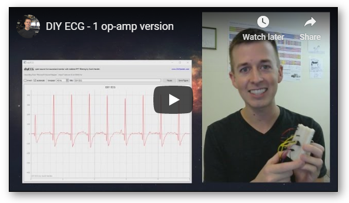
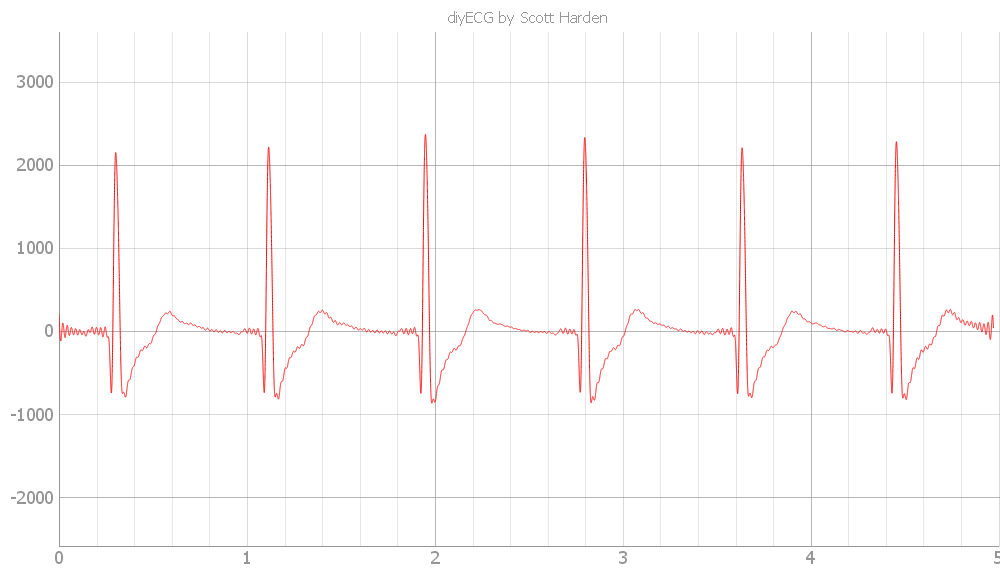
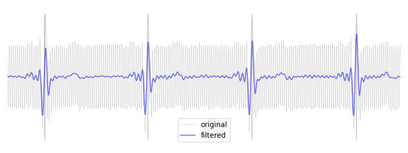
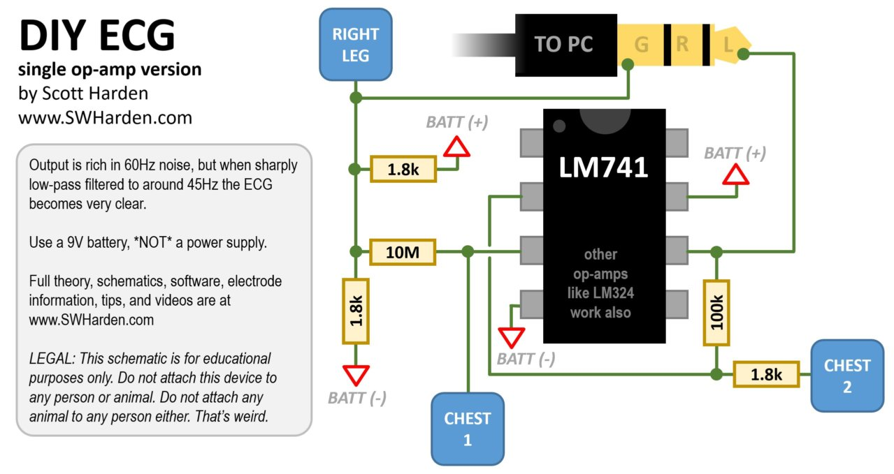
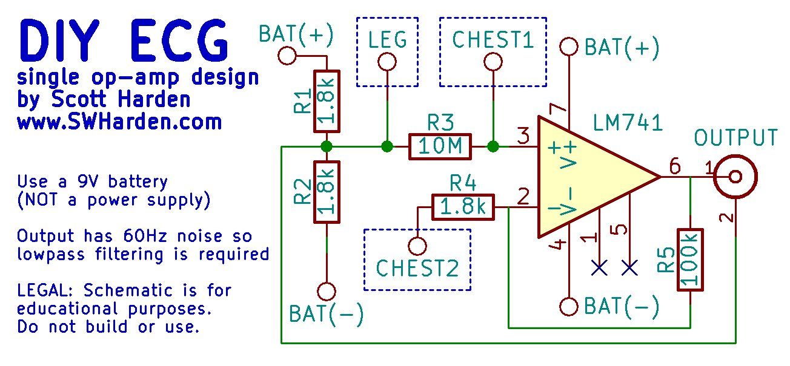

# DIY ECG (with 1 op-amp)
**A surprisingly good ECG is possible using a single op-amp.** The main idea is that you _allow_ the simple circuit to amplify noise (mixed in with your ECG), send the noisy signal into a PC using the microphone jack of the sound card, then use Python to remove the noise in real time, revealing the ECG.

**Project page:** http://www.swharden.com/wp/2016-08-08-diy-ecg-with-1-op-amp/

**YouTube demo:** https://www.youtube.com/watch?v=AfirWls9Sys

## Alternative Project (Sound Card ECG)
Many people have found this python source code difficult to use due to its dependence on version-specific libraries. A simpler click-to-run EXE for Windows that does essentially the same thing (written in C#) is available on the [**Sound Card ECG project page**](https://github.com/swharden/SoundCardECG).

Screenshot | Video Demonstration
---|---
 | 

## Python GUI

> **Warning: This Python 2 code is obsolete.** To get this software running you must install a legacy Python 2 on your system. Consider using a more modern software option like this [Sound Card ECG using C#/.NET](https://github.com/swharden/SoundCardECG).

This software needs certain libraries like PyQt4 and numpy, so the easiest way to make sure you have versions of everything that get along is to download a pre-packaged Python distribution. This software has been tested and works with WinPython 3.5.2.1 (not the Qt5 one)

* install [WinPython-64bit-3.5.2.1](https://sourceforge.net/projects/winpython/files/WinPython_3.5/3.5.2.1/) _(not the Qt5 one)_
* download this project and modify go.bat to reflect where your python.exe is
* build the circuit, plug it into your microphone hole, and run go.bat

## Python Analysis

If you build the 1-op-amp ECG circuit and record data as a WAV file you can use a Python script like [data/analyze.py](analyze.py) to reduce the noise and plot the result, creating an interactive figure like this:

## Hardware

---

